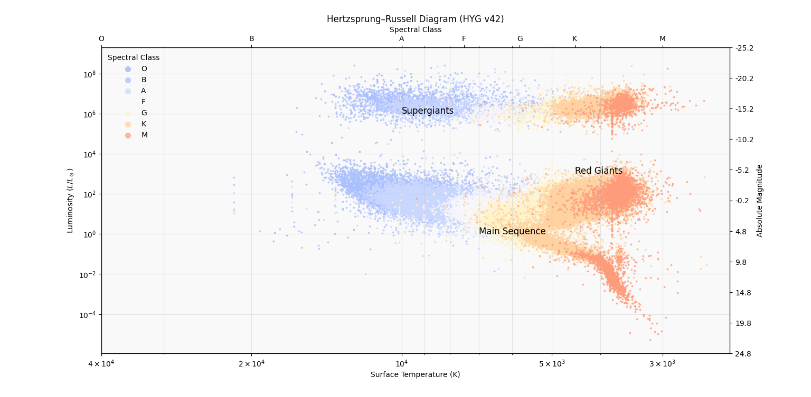

# Hertzsprung-Russell-HR-Diagram
Hertzsprung-Russell (HR) Diagram analysis and stellar evolution visualization using the HYG Database v4.2.
## Project Overview
The main objective of this study is to map stars from the HYG catalog into an HR diagram using astronomical computations:
- **Data Processing:** Surface temperatures ($T_{eff}$) are derived from B-V color indices using the **Ballesteros' empirical formula**.
- **Physical Conversions:** Absolute magnitudes are converted to solar luminosity units ($L/L_{\odot}$) for standard astrophysical comparison.
- **Visualization:** Stars are categorized and visualized across the Main Sequence, Giants, and Supergiants branches.

## Visual Output
The generated diagram illustrates the relationship between temperature and luminosity, featuring spectral class mapping on the top axis.



## Installation & Usage
1. Clone the repository:
   ```bash
   git clone [https://github.com/saliha-gul/hr-diagram-analysis.git](https://github.com/saliha-gul/hr-diagram-analysis.git)
